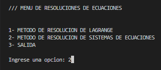
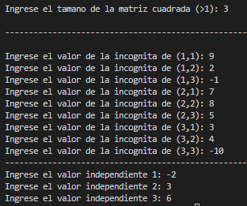
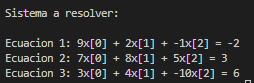
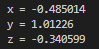

**Emiliano Mendoza Achirica 22310224 3G**  

**Elias Fabián López Gómez 22310260 3G**
# **PROYECTO FINAL** 
## INTERPOLACION DE LAGRANGE Y METODO DE GAUSS
   _Interpolacion de lagrange: Es una reformulación del polinomio de interpolación de Newton que el método evita el cálculo de las diferencias divididas._

   _Metodo Gauss: El método de Gauss-Jordan utiliza operaciones con matrices para resolver sistemas de
ecuaciones de n numero de variables._

## USO DEL PROGRAMA
> [!TIP]
> #### Makefile: _Para compilar y ejecutar usa el siguiente comando en la terminal de powershell:_ **"make run"**
## USO DEL MENÚ
> [!NOTE] 
> _Ingresar Opción 1 para usar el metodo de Lagrange, ingresar Opción 2 para usar el metodo de Gauss o ingresa la Opción 3 para salir._ 
>
>

> [!IMPORTANT]
> ## **Metodo Lagrange:**  
>  
>+ **Opción 1.-** Para ingresar los datos de la matriz 4x2, ingresa los datos alternando entre las "x" y las "y".
>
>**Ejemplo:**
>
>
>
>
>+ **Opción 2.-** Para hacer el calculo de la interpolación, ingresa tu valor de "x" a interpolar. 
>
>**Ejemplo:**
>
>
>
>
>+ **Opción 3.-** Para hacer el calculo del polinomio, es decir, hacer la suma de la interpolacion y mostrar tu resultado.
>
>**Ejemplo:**
>
>
>
>+ **Opción 4.-** Para regresar al menú principal.  
>
> ## **Metodo Gauss:**
>
>+ **Opción 1.-** Para definir el tamaño de la matriz e ingresar los valores de la incognita y los valores independientes.
>
>**Ejemplo:**
>
>
>
>
>+ **Opción 2.-** Para visualizar el sistema a resolver.
>
>**Ejemplo:**
>
>
>
>
>+ **Opción 3.-** Para mostrar los resultados de cada incognita (x,y,z).
>
>**Ejemplo:**
>
>
>
>
>+ **Opción 4.-** Para regresa al menu principal.   
>

